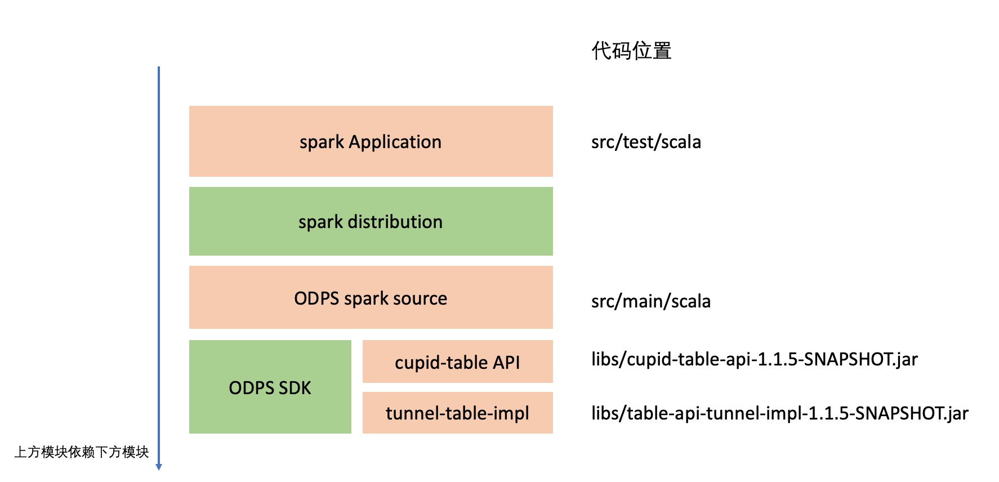

there was an [improvement proposal](https://docs.google.com/document/d/1DDXCTCrup4bKWByTalkXWgavcPdvur8a4eEu8x1BzPM/edit#heading=h.nxp4e06em2bl) for spark_datasource_v2, the spark with v3.1 version only supports the implementation that matches to [spark datasource v2 improvement proposal] (https://docs.google.com/document/d/1DDXCTCrup4bKWByTalkXWgavcPdvur8a4eEu8x1BzPM/edit#heading=h.nxp4e06em2bl). spark-datsource-v3.1 is an implementation that matches to the improvement proposal. Developers can use this datasource to access Alibaba Cloud MaxCompute tables on the spark3.1 engine. The supported operations are as follows:

|Table Type|Mode of Operation|Support|
|:----|:----|:----|
|internal non-partitioned table| read | Support |
|internal non-partitioned table| write | Support
|Internal Partition Table | Partition Read | Support |
|Internal Partition Table | Full-scan Read | Support |
|Internal Partition Table | Partition append | Support |
|Internal Partition Table | Partition overwrite | Support |
|Internal Partition Table | Dynamic partition append | Support |
|Internal Partition Table | Dynamic aprtition overwrite | Not Supported |

## 1 Introduction to spark-datasource-v3.1



The content of the module is shown in the figure above. spark-datasource-v3.1 only contains the red background module, and the green background module needs to be prepared by the user. The dependencies between modules are: the upper module will depend on the lower module. The introduction of each module is as follows.

- spark Application exists in the form of code, located in the ${project.dir}/spark-datasource-v3.1/src/test/scala directory. It is not only the self-test code of the project, but also the sample code using spark-datasource.
- The spark distribution is actually the spark engine itself, and this project has passed the test on the spark-3.1 engine. Users can download [spark-3.1 engine](https://archive.apache.org/dist/spark/spark-3.1.2/) for trial.
- The ODPS spark datasource exists in the form of code and is located in the ${project.dir}/spark-datasource-v3.1/src/main/scala directory. This part interacts with the spark engine according to the [spark datasource v2 improvement proposal](https://docs.google.com/document/d/1DDXCTCrup4bKWByTalkXWgavcPdvur8a4eEu8x1BzPM/edit#heading=h.nxp4e06em2bl), and uses the [MaxCompute official SDK](https://help.aliyun.com/ document_detail/34614.html) to access table metadata, and use [tunnel](https://help.aliyun.com/document_detail/27835.html) to access MaxCompute table data.
- ODPS SDK is a jar package submitted to the MAVEN repository, which has been configured in the pom.xml file dependency. Users will automatically download and package when building this module. spark data source uses the SDK to get the meta information of the table. For example: column names and types, partition columns and types, all partitions of a table, and so on. Click to view the [MaxCompute official SDK](https://help.aliyun.com/document_detail/34614.html) introduction.
- The cupid-table API exists in the form of a jar package, located in the ${project.dir}/spark-datasource-v3.1/libs directory. The cupid-table API encapsulates the environment differences and provides a stable API for the engine. If the engine runs on MaxCompute cluster, it can directly access MaxCompute physical data. If the engine runs outside MaxCompute cluster, you need to use [tunnel](https://help.aliyun.com/document_detail/27835.html) to access MaxCompute table data. The existence of cupid-table solves these environmental differences, and spark-datasource only needs to consider the feature list of cupid-table API.
- tunnel-table-impl exists as a jar package, located in ${project.dir}/spark-datasource-v3.1/libs. This is an implementation of cupid-table API, which relies on [Aliyun tunnel](https://help.aliyun.com/document_detail/27835.html).

## 2 Build method

First, go to the spark-datasource-v3.1 directory.
```shell
cd ${project.dir}/spark-datasource-v3.1
```


Second, execute the mvn command to build spark-datasource.
```shell
mvn clean package jar:test-jar
```

Finally, confirm the build result.
```text
# spark-datasource
ls -l ${project.dir}/spark-datasource-v3.1/target/spark-datasource-1.0-SNAPSHOT-jar-with-dependencies.jar

# test-case/example
ls -l ${project.dir}/spark-datasource-v3.1/target/spark-datasource-1.0-SNAPSHOT-tests.jar
``` 

## 3 How to use

First, configure the SPARK_HOME environment variable to point to the root directory of the spark v3.1.2 engine. The following figure shows the environment variables of the test environment.


Then, enter the SPARK_V3.1 engine root directory.

```shell
cd ${SPARK_HOME}
```

hen, perform a table read operation.
```shell
./bin/spark-submit \
    --master local \
    --jars ${project.dir}/spark-datasource-v3.1/target/spark-datasource-1.0-SNAPSHOT-jar-with-dependencies.jar,${project.dir}/spark-datasource-v2.3/libs/cupid-table-api-1.1.5-SNAPSHOT.jar,${project.dir}/spark-datasource-v2.3/libs/table-api-tunnel-impl-1.1.5-SNAPSHOT.jar \
    --class DataReaderTest \
    ${project.dir}/spark-datasource-v3.1/target/spark-datasource-1.0-SNAPSHOT-tests.jar \
    ${maxcompute-project-name} \
    ${aliyun-access-key-id} \
    ${aliyun-access-key-secret} \
    ${maxcompute-table-name}
    
#example
./bin/spark-submit \
    --master local \
    --jars ${project.dir}/spark-datasource-v3.1/target/spark-datasource-1.0-SNAPSHOT-jar-with-dependencies.jar,${project.dir}/spark-datasource-v2.3/libs/cupid-table-api-1.1.5-SNAPSHOT.jar,${project.dir}/spark-datasource-v2.3/libs/table-api-tunnel-impl-1.1.5-SNAPSHOT.jar \
    --class DataReaderTest \
    ${project.dir}/spark-datasource-v3.1/target/spark-datasource-1.0-SNAPSHOT-tests.jar \
    test_project \
    ${aliyun-access-key-id} \
    ${aliyun-access-key-secret} \
    test_o
```


hen, perform a table read operation.
```shell
./bin/spark-submit \
    --master local \
    --jars ${project.dir}/spark-datasource-v3.1/target/spark-datasource-1.0-SNAPSHOT-jar-with-dependencies.jar,${project.dir}/spark-datasource-v2.3/libs/cupid-table-api-1.1.5-SNAPSHOT.jar,${project.dir}/spark-datasource-v2.3/libs/table-api-tunnel-impl-1.1.5-SNAPSHOT.jar \
    --class DataWriterTest \
    ${project.dir}/spark-datasource-v3.1/target/spark-datasource-1.0-SNAPSHOT-tests.jar \
    ${maxcompute-project-name} \
    ${aliyun-access-key-id} \
    ${aliyun-access-key-secret} \
    ${maxcompute-table-name} \
    ${partition-descripion} 
    
# example
./bin/spark-submit \
    --master local \
    --jars ${project.dir}/spark-datasource-v3.1/target/spark-datasource-1.0-SNAPSHOT-jar-with-dependencies.jar,${project.dir}/spark-datasource-v2.3/libs/cupid-table-api-1.1.5-SNAPSHOT.jar,${project.dir}/spark-datasource-v2.3/libs/table-api-tunnel-impl-1.1.5-SNAPSHOT.jar \
    --class DataWriterTest \
    ${project.dir}/spark-datasource-v3.1/target/spark-datasource-1.0-SNAPSHOT-tests.jar \
    test_project \
    ${aliyun-access-key-id} \
    ${aliyun-access-key-secret} \
    test_o \
    20211201
```
